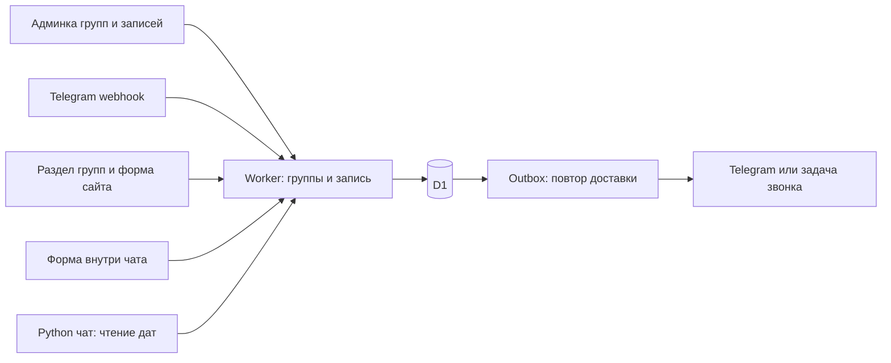

# Implementation Plan: единые группы и запись

**Branch**: рабочая ветка не меняется на этапе документации | **Date**: 2026-09-29 | **Spec**: [spec.md](spec.md)
**Input**: `specs/010-group-booking/spec.md`

## Summary

Один владелец групп и записей: существующий TypeScript Worker `bot/` с D1. Админка групп и записей обслуживается этим Worker под Cloudflare Access. Используем визуальную структуру существующей простой админки `chat_agent/static/`, но группы больше не редактируются в Python. Статический сайт, Telegram и Python-чат получают одинаковые группы из Worker; браузер отправляет структурированные заявки непосредственно в Worker. Цены, база знаний и бюджет AI остаются на прежних местах.

MVP дат: US1+US2, без приема записей до готовности US3+US4+US5. Полная первая версия включает все пять историй. Текущий этап: только документы. Архитектурные решения зафиксированы; инфраструктурные параметры выясняются перед staging, без выдуманных ID и hostname.

## Technical Context

- Language/Version: TypeScript ^5.5.0, plain HTML/CSS/ES modules; Python 3.12+ адаптер.
- Primary Dependencies: существующие Wrangler ^4.127.1, Cloudflare types ^5.20260901.1, Vitest ^4.1.11, Workers plugin ^1.1.2; Playwright 1.63.0; Gunicorn 23.0.0, PyJWT 2.10.1 в Python. Lockfile определяет фактические версии. Для Worker JWT подобрать и закрепить поддерживаемую библиотеку при реализации; не писать криптографию вручную.
- Storage: существующая D1, новые таблицы миграциями. SQLite Python остается ценам/бюджету, не реплика расписания.
- Testing: Node, Vitest на локальной D1, pytest для Python, Playwright плюс CUA на 320/390/1280 px.
- Platform: Workers fetch + scheduled, GitHub Pages, существующий VPS только для ответов AI.
- Goals: максимум 3 будущие группы на курс, 10000 исторических записей как тестовый объем; 20 конкурентных подтверждений; обновление видимой страницы <=60 секунд; без Redis, очереди отдельного провайдера и нового frontend framework.
- Constraints: авторизация на сервере, конечная ретеншн, no-store для динамических групп, no PII в AI/аналитике, ни одна дата не вычисляется моделью.

## Constitution Check

До и после проектирования: PASS по пунктам 1-6. Статический стек сохранен; Worker расширяется в существующей части; Python-адаптер меняет только источник групп. Модель не пишет дату/цену/запись. Домен отделен от UI/транспорта. Документы содержат проверки и ограничение внешних действий. `\!notes/` уже есть в `.gitignore`.

## Project Structure

Документы: `spec.md`, `plan.md`, `research.md`, `data-model.md`, `contracts/api.md`, `quickstart.md`, `tasks.md`, `checklists/requirements.md`, `review.md`.

Будущие изменения:
- `bot/src/groups.ts`, `bookings.ts`, `booking-api.ts`: домен, транзакции и HTTP.
- `bot/src/inbox.ts`, `outbox.ts`, `admin-auth.ts`: надежность/доступ.
- `bot/src/index.ts`, `router.ts`, `conversation.ts`, `types.ts`, `cleanup.ts`: интеграция в текущего бота.
- `bot/admin/index.html`, `admin.js`, `admin.css`: статическая мобильная админка через Worker assets; маршруты API защищаются независимо от файлов.
- `bot/migrations/0003_group_booking.sql` и следующие при необходимости; старые миграции не переписываются.
- `bot/test/groups.test.ts`, `bookings.test.ts`, `booking-api.test.ts`, `inbox.test.ts`, `outbox.test.ts`, `admin-auth.test.ts`, существующие schema/cleanup/webhook tests.
- `js/groups-logic.js`, `groups.js`, `booking-form.js`, `index.html`, `js/main.js`, `js/chat.js`, `css/style.css`, `css/chat.css`.
- `chat_agent/group_client.py`, `harness.py`, `facts.py`, `http_app.py`, `static/admin.js`, тесты адаптера и ответов.
- `baza-znaniy/` исходные инструкции и соответствующие TXT; generated/kb.ts только через генератор.

## Решение архитектуры

D1 является единственным источником для домена. Запретить старые записи `next_group_date` и Python `save_group` после cutover. Никакой двусторонней синхронизации. Фактический production Worker/D1 еще проверить: в репозитории placeholder database_id.

Админка на том же origin, что ее API, за Access. Проверять JWT (подпись/JWKS, iss, aud, exp) и allowlist сотрудников внутри Worker, в том числе при прямом вызове workers.dev. Проверка Origin + CSRF на изменениях. Нет токенов администратора в JS/localStorage. Неполная auth-конфигурация закрывает admin routes, но не публичное расписание. Секреты остаются wrangler secret, без `[vars]`.

## Простое управление

Экран «Группы»: максимум три карточки, календарь/время, предварительный или подтвержденный старт, переключатель приема заявок, счетчики учеников. Архив отдельно. Первичное создание: дата + 1-3 группы; 14 дней фиксировано для v1. Следующая группа добавляется одной кнопкой, показывается предпросмотр.

Перенос: дата, «Только эта» / «Эта и следующие предварительные», таблица до/после, число затронутых людей, одна кнопка сохранения. Следующие группы сдвигаются на ту же delta в календарных днях. При подтвержденной следующей группе, пересечении, прошедшем старте или устаревшей версии - вся операция отклоняется. Время в Asia/Tbilisi. Не добавлять новые группы внутри переноса.

Экран «Записи»: фильтр группы/статуса, поиск, ожидающие/подтвержденные, «Нужно связаться». Подтверждение даты старта группы и подтверждение места ученика являются разными действиями.

## Транзакции и конкуренция

D1 batch используется как транзакция; обычный JS read-then-write не обеспечивает нужную защиту. `UPDATE ... WHERE revision=?` с нулем измененных строк сам по себе не откатывает batch. Для расписания внутри batch сначала вставляется guard с NOT NULL на обеих ревизиях и CHECK(expected_revision=actual_revision), actual читается SQL-подзапросом из schedule_state; несовпадение вызывает SQL-ошибку и откат. Затем изменение групп, audit, outbox и увеличение schedule revision. Guard связан с operation_id, убирается внутри того же batch. Весь SQL параметризован. Guard вставляется через VALUES со scalar subquery и NOT NULL, а не INSERT SELECT, который может вставить ноль строк. Admission guard в той же транзакции проверяет существование группы, revision, lifecycle, starts_at_utc > now, открытый набор и capacity для pending/confirm/transfer. Предварительное чтение служит только UI.

Все операции записи/подтверждения/переноса используют уникальный operation_id и command_results. Повтор с тем же ключом и тем же нормализованным телом возвращает сохраненный результат; другое тело дает 409. Ключ для web случайный 128+ бит, хранится до завершения отправки; ключ Telegram связан с update_id и конкретным действием. turnstile_token исключается из business digest, новая CAPTCHA при том же теле не создает новую операцию. Ключ является технической квитанцией, не дает PII и доступа к админке.

Вместимость защищается SQL-ограничением/trigger на переход в confirmed и перенос confirmed в другую группу: count текущих confirmed < capacity в той же транзакции. Уменьшение capacity также защищается в БД. Репетиция на локальной D1 должна доказать корректность схемы; до нее release закрыт. При конфликте ничего не меняется, включая audit/outbox. Для каскада с положительной delta обновлять группы от последней к первой, с отрицательной от первой к последней; конечный график заранее проверяется внутри guard. Это исключает промежуточный конфликт unique даты при сдвиге ровно на 14 дней. Не хранить отдельный изменяемый счетчик занятых мест.

## Прием Telegram и доставка

Сейчас processed_updates фиксируется до routeUpdate и ошибки получают 200; заменить для нового контура на durable inbox. Webhook проверяет оба существующих секрета, сохраняет событие в D1 и только тогда возвращает 200; отказ D1 дает retryable 503. После приема сразу запускается обработка, cron раз в минуту подбирает незавершенные события. Ответ 200 означает надежный прием, не завершение действий.

Inbox unique update_id, lease с окончанием, attempts, retry_at, state. Обработка последовательна внутри chat_id с lease; выбирается самый ранний незавершенный из принятых updates, его будущий retry_at блокирует обгон последующими. Порядок еще не доставленных Telegram updates не обещается; мутации проверяют актуальный lease и идемпотентный operation_id. Нет двух одновременных переходов анкеты в одном чате. Durable этап анкеты, заявка, audit и outbox коммитятся атомарно. Все исходящие ответы этих сценариев отправляются через outbox. До создания booking получатель определяется по краткоживущей conversation_id с TTL<=24h; prompts истекших/завершенных сессий отменяются, финальный ответ ссылается на booking. Сохраненный результат позволяет завершить событие после crash без повторной мутации. Начальная конфигурация webhook max_connections=1 уменьшает переупорядочивание; тестировать конкурентный дубль независимо от настройки.

Outbox хранится в D1, внешняя очередь пока не нужна. Lease исключает обычную параллельную отправку. Retry: 1, 5, 15, 60 минут, далее раз в час, максимум 24 часа; 429 уважает retry_after; permanent 403/неизвестный чат создает manual_contact. Успешный HTTP Telegram означает sent, не прочтение. Crash после отправки до фиксации может дать повтор сообщения; exactly-once внешней доставки не обещать. Номер заявки и версия группы видны в тексте. Staff-карточки содержат номер, группу и защищенную ссылку без имени/телефона: удаление D1 не удаляет копии Telegram. Очередь связывает каждое уведомление с конкретной booking/получателем и версиями booking/group; старое подтверждение после отмены и старый вопрос анкеты после перехода шага становятся superseded. Просроченные неподанные уведомления о дате заменяются текущей версией; уже отправленные не переписываются молча.

## Сайт и чат

Один GET groups, no-store и чтение primary D1; read replication не включать в v1. Обновление страницы при открытии, возвращении вкладки в фокус и раз в 30 секунд пока видима. После ошибки убрать актуальный статус/кнопку записи, показать retry. На отправке сервер повторно сверяет group revision/start/прием заявок. Нет статической даты или localStorage fallback.

Форма сайта и форма чата используют один booking-form модуль и POST Worker, обходя VPS и LLM. Кнопка «Записаться» в чате доступна даже при отказе AI. Имя/телефон вводятся в выделенной форме и не передаются в историю модели. Для вопросов о датах Python вызывает read-only endpoint, timeout 3 сек, без локального fallback; в одном ответе используется один snapshot. Старый редактор групп заменяется ссылкой на единую админку. Цены остаются в нынешнем каталоге.

## Защита и срок хранения

Public groups возвращает только расписание/доступность, без списка учеников. Web booking: allowlist Origin, ограничения размера/частоты, server-side Turnstile, экранирование, строгая схема. CORS не является авторизацией. Idempotency проверяется безопасно при retry после использованной Turnstile-проверки; совпавший ранее принятый command может вернуть только неперсональную квитанцию.

Телефон не подтверждает личность. Совпадение телефона = флаг для сотрудника, без автоматического объединения и раскрытия. В v1 отдельный master customers не нужен: контакт хранится у записи, это упрощает ретеншн и семейные телефоны.

Срок: min(created_at+180d, terminal_at+90d), terminal_at фиксируется один раз и не сдвигается редактированием. Новые заявки не наследуют старое cleanup правило updated_at. Inbox payload и брошенные анкеты <=24h; outbox не копирует PII, разрешает ссылки при отправке. Audit только IDs/статусы/даты без телефонов. Детали: data-model.md. Истечение срока не отменяет занятого места, но прекращает связь; в админке заранее предупреждение за 7 дней.

## Выпуск, миграция и восстановление

1. Проверить фактические Worker/D1, hostname, Access/allowlist, cron, резервирование. Не брать production readiness из README: там смешаны исторические состояния.
2. Staging с отдельной D1 и тестовым ботом. Проверить auth и atomic guard/capacity/inbox before UI integration.
3. Экспорт старой D1, SQLite-каталога и действующей конфигурации в защищенное хранилище. Репетиция восстановления на изолированной базе. Не класть персональные экспорты в Git.
4. Аддитивные миграции: старые leads сохраняются отдельным legacy-разделом. group_id неизвестен, не угадывать по датам. Старые delivery pending разобрать отдельно, не терять карточки при cutover.
5. Сверить текущие реальные даты со школой, создать расписание и подтвердить предпросмотр. Исторические даты из spec не seed для production.
6. Выпустить общий источник дат, отключить старые writers, переключить все readers. Если любой канал остался на старом источнике, этап не завершен.
7. После проверок записей переключить сайт с FormSubmit и Telegram на единый контур; не отправлять каждую заявку одновременно в две системы. Старые email-заявки импортировать только из предоставленного источника и отдельной задачи.
8. Rollback: отключить новые submissions с понятным fallback на связь, сохранить D1 и новые данные, исправлять вперед. Не включать старые writers параллельно и не восстанавливать backup поверх новых заявок. Возврат старой версии кода допустим только с проверенной совместимостью схемы.
9. Цели эксплуатации: ежедневный защищенный backup с хранением 7 дней, RPO<=24h/RTO<=60m; дополнительно Time Travel в пределах реального тарифа. Restore-runbook повторяет cleanup до открытия сервиса и исключает повторную рассылку старого outbox.

## Готовность и ограничения

Готовность определяется quickstart.md и SC-001..006. Все функциональные задачи пока открыты. Внешние настройки, выпуск и реальные уведомления выполняются только при соответствующем разрешении; локальная реализация не заблокирована неизвестным production hostname.

## Complexity Tracking

Нарушений конституции нет. Durable inbox/outbox и SQL guards оправданы конкретными сбоями; выделенный брокер, отдельный CRM-сервис и двусторонняя реплика отвергнуты как лишние компоненты.
